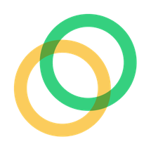

---
# try also 'default' to start simple
theme: vuetiful
# random image from a curated Unsplash collection by Anthony
# like them? see https://unsplash.com/collections/94734566/slidev
background: https://source.unsplash.com/collection/94734566/1920x1080
# apply any windi css classes to the current slide
class: 'text-center'
# https://sli.dev/custom/highlighters.html
highlighter: shiki
# show line numbers in code blocks
lineNumbers: false
# some information about the slides, markdown enabled
info: |
  ## Slidev Starter Template
  Presentation slides for developers.

  Learn more at [Sli.dev](https://sli.dev)
---

# Celo
A Multi-Asset Protocol for Decentralized Social Payments

### Max Mohammadi
### EY Blockchain - Celo Presentation

---

# A Need For Financial Inclusion

 

---

# Crypto - Barriers to Entry

 

- **Volatile** - Unpredictable supply & demand cause price instability 
- **Wallets** - Need to generate private/public key pairs to receive payments

 

# Celo - Solution to Crypto Adoption

 

### Proof-of-Stake and Mobile Focused Blockchain

- **Easy-of-Use** - Sending a payment is as easy as sending a text message
- **Wallets** - Address-based encryption allows users to use their friends' cell phone numbers as public keys
- **Stable Value Assets** - Monetary policy with elastic supply rules, backed by a variable-value reserve
- **Mobile Block Rewards** - All users involved in transactions are also able to participate in verifications
- **Social Impact** - Universal Basic Income trials (GiveDirectly & Grameen Foundation)
- **EigenTrust-Based Reputation** - Peer-to-Peer reputation algorithm

  

    

  

  

  

---

# Ease of Use

### With Just a Mobile Phone, Users Can:
  * Start saving
  * Spending money
  * Participate in loan programs

 

### Address-Based Verification:
  * Phone number public keys with permissionless private key generation
  * Identity attestation works such that a user can send Celo to a friend's phone number, regardless of whether or not his/her friend previously signed up for a wallet

  

    

  

---

# Stable Value Assets

* Multi-asset crypto reserve
* Tokenized plots of land in the rainforest -> tokenized carbon credits
* Elastic supply - contraction and expansion parameters based on demand and reserve values
* Governance mechanism which allows new local/fiat currencies to be introduced

* When coin supply needs to expand, the protocol creates new coins. But rather than distributing them to token holders, it uses them to purchase a basket of cryptocurrencies at market rates through a smart contract. These purchases get added to the reserves.

  

    

  

<!-- * While a single stable coin would be useful for several purposes (for example in cryptoasset trading and internet commerce), a more robust ecosystem would involve a family of local, regional, and utility stable value coins. The benefits of such a monetary ecology has been discussed broadly, for example in, but here we focus on one: a stable currency is only meaningful if it is stable vis-a-vis the price of goods and services that are purchased using that currency. Using a global currency for local transactions would introduce price volatility in regions where regional consumer price dynamics vary from the global consumer price dynamics
 -->

---

# Social Impact

---

# Future of Celo

* Celo as a CBDC
* Replacing montery policy

  

    

  

<!-- These are my notes on youtube videos:

- Celo is making it really easy to use stablecoins
- TVL = total value locked
- Korean yuan is the next best stablecoin for celo
- Best thing about celo is that they can add different assets to their reserve basket, such as nature backed assets, crypto, etc. It's now feasible to put tokenized carbon offset credits as well as tokenized land in the amazon rain forest. Most people in the future will want to choose to use a stablecoin that they know is good for the environment.

- Markus Franke youtube video series on stablecoins
- continue watching stablecoin videos
- break slides up into: 
  - ODIS for identity
  - stables for payments
  - social impact and community
  - mobile phone friendly
 -->